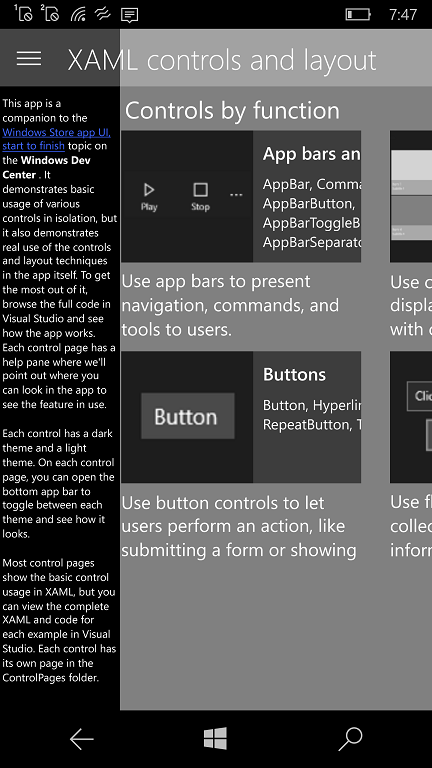
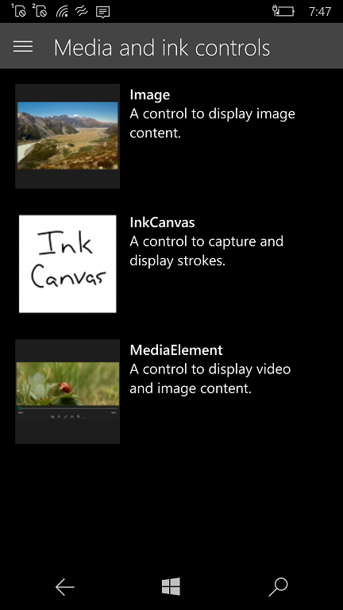
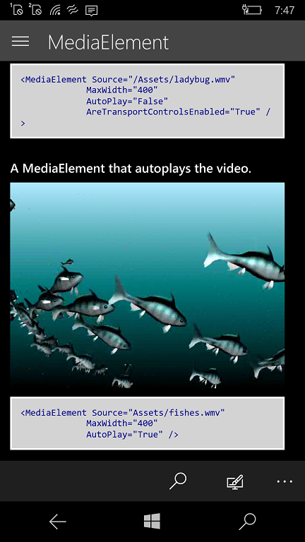

<!---
  category: ControlsLayoutAndText
  samplefwlink: http://go.microsoft.com/fwlink/p/?LinkId=619992&clcid=0x409
--->

# XAML UI basics sample

This sample shows all of the XAML controls in an interactive format.
My 2 cents : ported on ARM (and downshifted to os target 15063)

# Screenshots

Specifically, this sample shows how to:

- **Specify XAML controls in markup:** Each control page shows the markup used to create each example
- **Basic layout:** This sample will show all of the possible layout options for your app and allow you to interact with the panels to show how to achieve any layout you are looking for.
- **Adaptive UI:** In addition to showing how each control responds to different form factors, the app itself is responsive and shows various methods for achieving adaptive UI.

**Note** The Windows universal samples require Visual Studio 2019/2022 to build and Windows 10 to execute.
 
To obtain information about Windows 10, go to [Windows 10](http://go.microsoft.com/fwlink/?LinkID=532421)

To obtain information about Microsoft Visual Studio 2022 and the tools for developing Windows apps, 
go to [Visual Studio 2022](http://go.microsoft.com/fwlink/?LinkID=532422)

## Related topics

### Reference

<!-- Add links to related API -->

[Windows Store app UI, start to finish](http://msdn.microsoft.com/library/windows/apps/dn263191.aspx)

Each control page in the application has links to the relevant MSDN documentation for that control.

## System requirements

**Client:** Windows 10 / 11

**Server:** Windows Server 2016 Technical Preview

**Phone:**  Windows 10 (Mobile)

## Build the sample

1. If you download the samples ZIP, be sure to unzip the entire archive, not just the folder with the sample you want to build. 
2. Start Microsoft Visual Studio 2019 Preview 3 (2022) and select **File** \> **Open** \> **Project/Solution**.
3. Starting in the folder where you unzipped the samples, go to the Samples subfolder, then the subfolder for this specific sample, then the subfolder for your preferred language (C++, C#, or JavaScript). Double-click the Visual Studio 2015 Solution (.sln) file.
4. Press Ctrl+Shift+B, or select **Build** \> **Build Solution**.

## Run the sample

The next steps depend on whether you just want to deploy the sample or you want to both deploy and run it.

### Deploying the sample

- Select Build > Deploy Solution. 

### Deploying and running the sample

- To debug the sample and then run it, press F5 or select Debug >  Start Debugging. 
To run the sample without debugging, press Ctrl+F5 or selectDebug > Start Without Debugging. 
